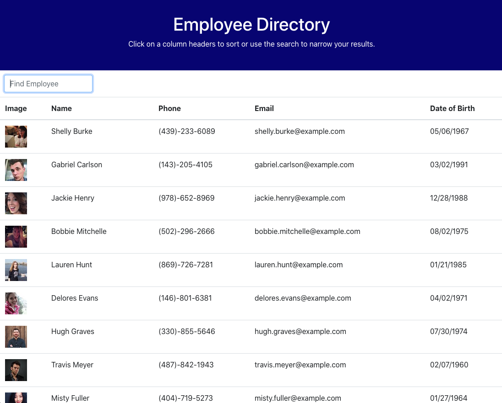

# Employee Directory


## Description
Uses React to lists employees and the employees can be searched and sorted.

## Links
Deployed link: https://employee-directory-react-3.herokuapp.com/

Repo link: https://github.com/jttilley/employee-directory

## Author
Jason Tilley

## Tech Used
HTTP, CSS, JavaScript, Bootstrap, jQuery, Ajax, ES6, Node.js, express, React

## Table of Contents
  * [Example](#example)
    
  * [Installation](#installation)
  
  * [Usage](#usage)
  
  * [License](#license)
  
  * [Questions](#questions)
    

## Example


## Installation
To install the necessary denpendencies, run the following command:
```
npm i
```

## Usage
* Fork it
* Clone it to your computer
* run "npm start" in the terminal

## License
The license for this project is: *MIT* ©  2020 Jason Tilley
  
## Questions
If you have any questions you can email me at: jttilley007@gmail.com

Also feel free to check out my GitHub page here: https://github.com/jttilley
  

